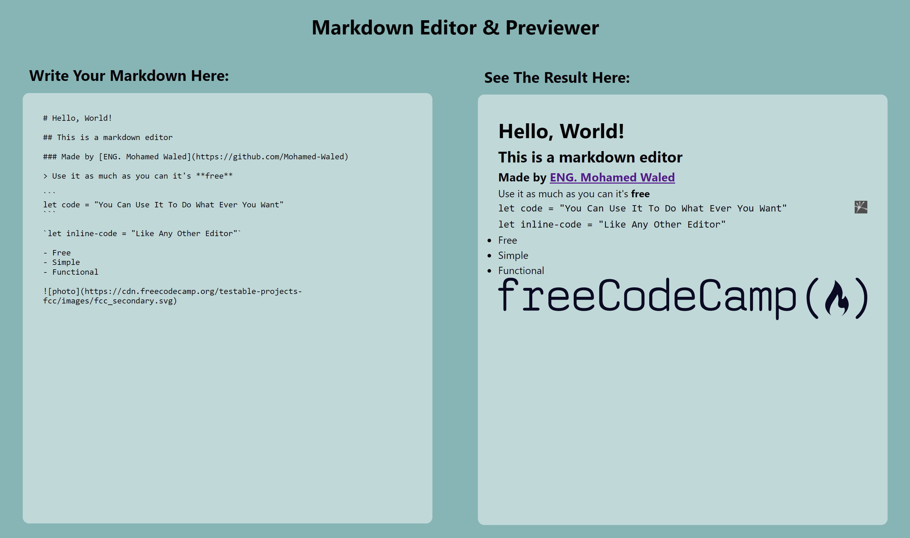
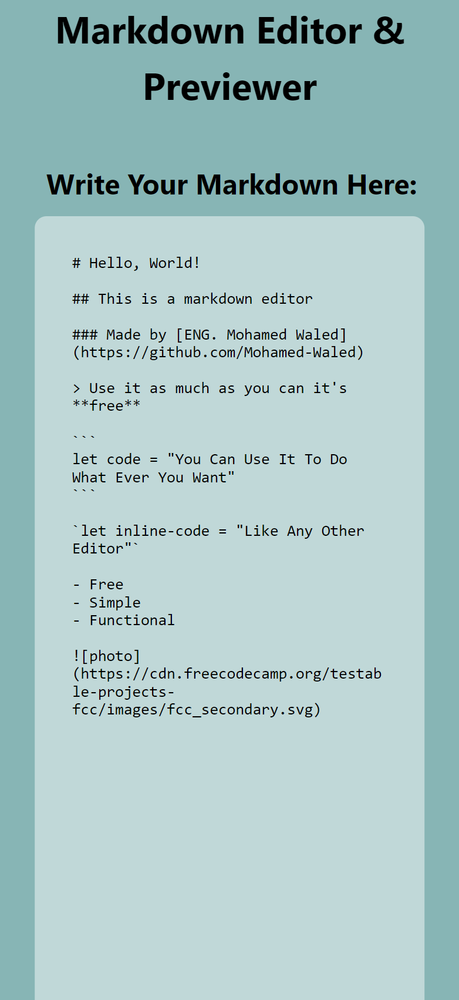

# FreeCodeCamp - Front End Development Libraries Projects - Build a Markdown Previewer

This is a solution to the [Build a Markdown Previewer](https://www.freecodecamp.org/learn/front-end-development-libraries/front-end-development-libraries-projects/build-a-markdown-previewer) 

## Table of contents

- [Overview](#overview)
  - [Screenshot](#screenshot)
  - [Links](#links)
- [My process](#my-process)
  - [Built with](#built-with)
- [Author](#author)

## Overview

### Screenshot

### Links

- Live Site URL: [Live site URL here]()

## My process

### Built with

- HTML5
- SCSS
- React.js
- npx create-react-app
- npm
- Marked library
- Visual Studio Code

## Author

- Linkedin - [@mohamed-waled](https://www.linkedin.com/in/mohamed-waled-82a51a1bb/)